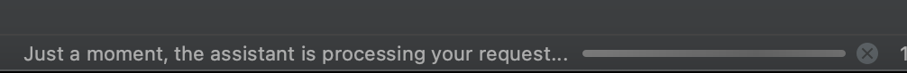
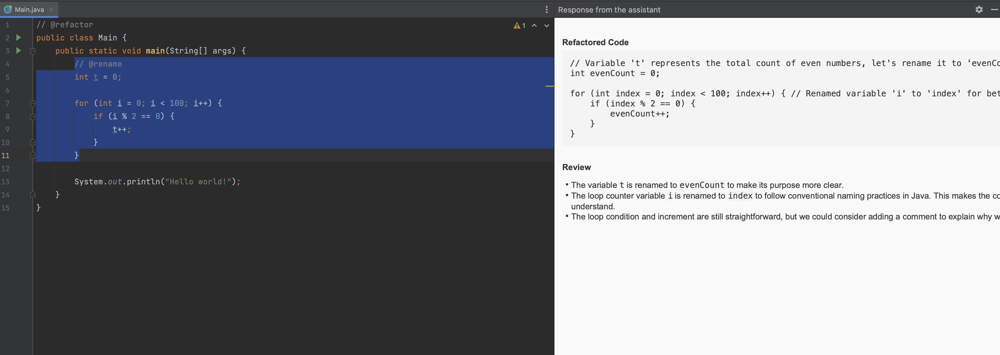

# Local Code Assistant

## How to Use

1. Install [Ollama](https://ollama.com/).
2. Clone this repository:
    - `git clone https://github.com/wool0826/LocalCodeAssistant.git`
3. Execute the following command:
    - `./gradlew jar`
4. Install this plugin on your IntelliJ IDEA.
5. Use the shortcut `Ctrl + Cmd + B` (Mac) or `Ctrl + Alt + B` (Windows) on the selected code.
    - Ensure that you write a comment line at the beginning of the code snippet.

```java
// Review the code below
public class TestClass {
	public int sum(int a, int b) {
		return a + b;
	}
}
```

## Keywords

1. `@review`
    - Request a code review.
2. `@refactor`
    - Request code refactoring.
3. `@rename`
    - Request renaming of unclear variable names.
4. `@performance`
    - Request performance checks.
5. `@security`
    - Request security checks.

### Sample



