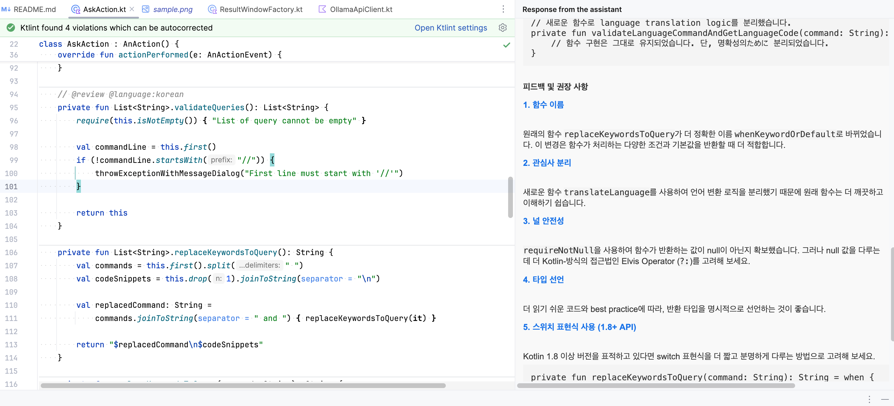

# Local Code Assistant

## How to Build

1. Clone this repository:
   - `git clone https://github.com/wool0826/LocalCodeAssistant.git`
2. Run the following command:
   - `./gradlew clean build`
3. The plugin can be found in the `./build/distributions/` directory as a `.jar` file.

## How to Use

1. Install [Ollama](https://ollama.com/).
2. Execute this command (optional):
   - `ollama pull llama3.1`
   - If you don't execute this command beforehand, it will automatically be performed when needed, but it may cause a delay in the first response time.
3. Install this plugin on IntelliJ IDEA (either by self-building it or by downloading it from the [releases](https://github.com/wool0826/LocalCodeAssistant/releases) page).
4. Use the shortcut `Ctrl + Cmd + B` (Mac) or `Ctrl + Alt + B` (Windows) on the selected code.
   - Ensure that a comment line is written at the beginning of the code snippet.

```java
// Review the code below
public class TestClass {
	public int sum(int a, int b) {
		return a + b;
	}
}
```

## Keywords

1. `@review`
    - Request a code review.
2. `@refactor`
    - Request code refactoring.
3. `@rename`
    - Request renaming of unclear variable names.
4. `@performance`
    - Request performance checks.
5. `@security`
    - Request security checks.
6. `@language:${languageCode}`
    - Translate response to languageCode
    - ex) @language:korean

### Sample



